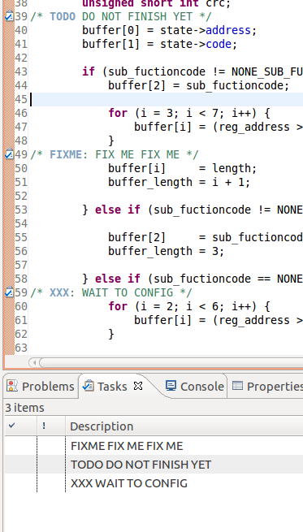

# 东莞北航研究院代码规范
## 1.声明注释
### 1.1文件说明注释
范例：
```cpp
/**
 *\file       :
 *\brief      :
 *\author     :
 *\data       :
 *\version    :
 *\copyright  :
 */
```
- \\file:后面跟随文件名字
- \\brief:文件的简述
- \\author:该文件的作者
- \\date:该文件的书写时间
- \\version：该文件的版本
- \\copyright:文件的著作所有权

**提示**，书写内容都建议采用英文。

### 1.2函数注释
范例：
```cpp
/**
 *\brief          :
 *\detail         :
 *
 *\param[in]      :
 *\param[out]     :
 *\param[in,out]  :
 *
 *\retbal         :
 */
```


>函数注释规范采用上述格式，满足Doxygen软件的代码规范，经测试能被Doxygen软件识别函数注释，并且生成归档 。注释第一行为“/\*\*”开始对函数进行注释，后面每一行都以“\*”号开始，且“\*”号要与第一行注释的第一个“\*”号进行对齐，最后以“\*/”结束函数的注释。注释内容如下：

- \\brief:函数的简述
- \\detail:函数的详细描述，当函数功能比较简单的时候，可以省略；
- \\param[in/out/in,out]：函数的参数，中括号的内容代表参数的传递方式，in为输入，out为输出，in,out既有输入也有输出，后面接参数的说明。当函数不含参数的时候，可以省略；
- \\retval:函数的返回值，并且对返回值进行说明；


>其中，函数描述与参数，参数与返回值之间空格一行，并且注释内容以“:”号进行对齐，上述描述都采用英文进行书写。
###1.3段注释书写


范例：


```cpp
int i;

/**********************
 *content
 **********************/
```
>通常段注释用于描述程序的一块流程。首先段注释要与上文空格一行，然后再书写段注释，对下面一段代码进行注释。段注释第一行“\*”数量适中即可，第二行以“\*”号开始，书写对下面代码的注释内容。一般来说，注释行长度不能超过“\*”号长度，注释长度幅长的时候，应该换行，最后以一行“\*”号结束注释。注意，开始和结束注释的“\*”号注释数量要对齐，注释的每行起始都要以“\*”号对齐，注释内容建议采用英文。
###1.4行注释

范例：

```cpp
int result = 0;

tv.tv_sec  = 0;
tv.tv_usec = 2000;      	/* set select() blocking time between two bytes */

FD_ZERO(&rfd);              /* clean up the file descriptor monitor */
FD_SET(leddar_fd, &rfd);    /* set leddar's file descriptor into the monitor */
```
>通常行注释用于描述变量的声明，代码规范行注释采供/\* content \*/ 的方式进行行注释，注意在书写“content”前后都要有空格与“\*”号进行分开，书写上采用英文进行书写，而且行注释相临近的要进行对齐处理。提高代码可读性。


### 1.5全局变量的注释

>采用和结构体成员相同的注释格式：“/\*!< content \*/”，content前后要有空格与“<”和“\*”隔开。


### 1.6全局变量声明及注释

范例：

```cpp
static int g_len;    /*!< 作用在本文的全局变量 */
int __glen:         /*!< 作用在本工程的全局变量 */
```


> - 作用于本文件的全局变量（即带有static修饰的全局变量）的命名：“g_”+变量名
- 作用域为本工程的全局变量的命名“\__g_”+变量名，注意：前面是两个下划线。

### 1.7联合体注释

```cpp
typedef union _SbgBinaryLogData
{
	SbgLogStatusData		statusData;			  /*!< Stores data for the SBG_ECOM_LOG_STATUS message. */
	SbgLogImuData			imuData;			      /*!< Stores data for the SBG_ECOM_LOG_IMU_DATA message. */
	SbgLogEkfEulerData		ekfEulerData;		/*!< Stores data for the SBG_ECOM_LOG_EKF_EULER message. */
	SbgLogEkfQuatData		ekfQuatData;		  /*!< Stores data for the SBG_ECOM_LOG_EKF_QUAT message. */
	SbgLogEkfNavData		ekfNavData;			  /*!< Stores data for the SBG_ECOM_LOG_EKF_NAV message. */
	SbgLogShipMotionData	shipMotionData;	/*!< Stores data for the SBG_ECOM_LOG_SHIP_MOTION               or SBG_ECOM_LOG_SHIP_MOTION_HP message. */
	SbgLogOdometerData		odometerData;		/*!< Stores data for the SBG_ECOM_LOG_ODO_VEL message. */
	SbgLogUtcData			utcData;			      /*!< Stores data for the SBG_ECOM_LOG_UTC_TIME message. */
	SbgLogGpsPos			gpsPosData;			    /*!< Stores data for the SBG_ECOM_LOG_GPS_POS message. */
	SbgLogGpsVel			gpsVelData;			    /*!< Stores data for the SBG_ECOM_LOG_GPS#_VEL message. */
	SbgLogGpsHdt			gpsHdtData;			    /*!< Stores data for the SBG_ECOM_LOG_GPS#_HDT message. */
	SbgLogGpsRaw			gpsRawData;			    /*!< Stores data for the SBG_ECOM_LOG_GPS#_RAW message. */
	SbgLogMag				magData;			       /*!< Stores data for the SBG_ECOM_LOG_MAG message. */
	SbgLogMagCalib			magCalibData;		 /*!< Stores data for the SBG_ECOM_LOG_MAG_CALIB message. */
	SbgLogDvlData			dvlData;			     /*!< Stores data for the SBG_ECOM_LOG_DVL_BOTTOM_TRACK message. */
	SbgLogPressureData		pressureData;	/*!< Stores data for the SBG_ECOM_LOG_PRESSURE message. */
	SbgLogUsblData			usblData;			  /*!< Stores data for the SBG_ECOM_LOG_USBL message. */
	SbgLogEvent				eventMarker;		  /*!< Stores data for the SBG_ECOM_LOG_EVENT_# message. */
	SbgLogDebug0Data		debug0Data;			/*!< Stores debug information */
	SbgLogFastImuData		fastImuData;		/*!< Stores Fast Imu Data for 1KHz output */
} SbgBinaryLogData;
```

>	结构体注释采用Doxygen注释规范，结构体说明的格式与函数注释规范的格式相同。但携带的说明只有 \\brief:和\\detail：用于简述和详述结构体。
	结构体成员的注释格式：/\*\!< content \*/对结构体成员进行注释，而且保持“/”对齐，content前后要有空格与“<”和“\*”隔开。


### 1.8联合体注释

范例：
```cpp
typedef enum _SbgVersionQualifier
{
	SBG_VERSION_QUALIFIER_DEV				= 0,							/*!< Development only version or pre-alpha. Customer shouldn't get this version qualifier. */
	SBG_VERSION_QUALIFIER_ALPHA				= 1,							/*!< Alpha version, missing features, can be unstable and could cause crashes or data loss. API can still change. */
	SBG_VERSION_QUALIFIER_BETA				= 2,							/*!< Beta version, features are freezed, can be unstable and could cause crashes or data loss. API shouldn't change. */
	SBG_VERSION_QUALIFIER_RC				= 3,							/*!< Release Candidate, features are freezed, with no known bug. API is freezed. */
	SBG_VERSION_QUALIFIER_STABLE			= 4,							/*!< Stable release, the version is the standard delivered one. */
	SBG_VERSION_QUALIFIER_HOT_FIX			= 5								/*!< Hot fixes were applied on a stable release. It should be bug fixes. This qualifier is temporary as the version should return to stable release as soon as the test procedure has been performed. */
} SbgVersionQualifier;

```

>枚举类型注释采用Doxygen注释规范，枚举类型说明的格式与函数注释规范的格式相同。但携带的说明只有 \\brief:和\\detail：用于简述和详述枚举类型，与结构体注释一致。
	枚举类型成员的注释格式：\/\*\!< content \*/对枚举类型成员进行注释，而且保持“/”对齐，content前后要有空格与“<”和“\*”隔开。


  ### 1.9运算符号书写

  范例：

  ```cpp

			data->leddar_dec[rev_buf[i]].distance[l]  = (unsigned short int)((rev_buf[i - 4] << 8) |
																			  rev_buf[i - 5]);				/* put the distance into the structure */
			data->leddar_dec[rev_buf[i]].amplitude[l] = ((rev_buf[i - 3] << 8) |
														  rev_buf[i - 2]) * 1.0 / 256;						/* put the amplitude into structure */
			data->leddar_dec[rev_buf[i]].flag[l]      = rev_buf[i - 1];										/*put the flag into the structure*/
			data->leddar_dec[rev_buf[i]].num++;
			continue ;
  ```
>所有运算符号（除了++,--,->，.,!.~,\*,&等一元运算符）所有的运算符，左右两端都有有空格。而且按照一定的格式进行对齐，例如上述例子，按照“=”号进行对齐，“i - 2”减号左右两边都有空格。当一行代码长度过长的时候要进行换行，而且换行按照一定的方式进行对齐，上例中的换行按照respond_fame进行对齐。


### 1.10 有意义的命名
>对文件，函数，常量，变量的命名要采用有意义的命名方式，增加对代码的可读性，要做到看到名字，就能联想到这个东西的作用。我们对于变量及函数的名字都是采用小写加下划线的命名规矩。命名规矩如下：
-	对于名字的采用，要取有意义的名字，能在全文中都能看出该名字的含义
-	尽量避免使用缩写，以免出现误解的含义。
-	用下划线把各单词进行分开，
比如:

```cpp
get_best_fit_model
load_best estimate_model

```


> -	在相同作用域中，不能出现两个同名的变量，即使编译器允许全局变量和局部变量名字相同也不能出现，以免出现不可预知的情况。
-	不要依赖大小写使命名独一无二，这样会导致程序可读性下降。
-	相近的命名采用下划线分开。比如：

```cpp
systst sys_tst
sysstst sys_s_tst
```
>- 变量的声明不能和结构体，枚举，或声明类型（typedef）的名字一样，即使编译器允许。

#### 1.10.1 常用的标准短命名


- c	:字符
- i,j,k :索引
- n	:计数器
- p,q	:指针
- s	:字符串

## 2特定结构
### 2.1函数的书写及调用
>` `函数名字书写采用小写加下划线的方式进行书写。在函数的定义中，函数的名字后面携带的括号与函数名字之间有一个空格，各参数之间逗号分隔，逗号后面有一个空格。在函数的定义中，大括号在新的一行中开始，然后书写函数内容，最后以大括号结束，大括号对齐。函数内容要适当进行空行，比如变量声明赋值与下面的运算进行分开.<p>
   函数的调用不要在函数名字和传递参数的括号之间留出空格，否则会报错。

范例：
```cpp
unsigned int crc16_calc (unsigned char *crc_buf, unsigned char crc_leni)
{
	unsigned char i, j;
	unsigned int crc_sumx;
	crc_sumx = 0xFFFF;

	for (i = 0; i < crc_leni; i++) {
		crc_sumx ^= *(crc_buf + i);
		for (j = 0; j < 8; j++) {
			if (crc_sumx & 0x01) {
				crc_sumx >>= 1;
				crc_sumx ^= 0xA001;
			} else {
				crc_sumx >>= 1;
			}
		}
	}
	return (crc_sumx);
}
```


## 2.2if判断结构书写

范例：
```cpp
if (min > 0) {

  /* check data validity if had received data */
  if (leddar_check_data(state, rev_buf, min)) {
    state->read_over = LEDDAR_DATA_VALID;
  } else {

    state->response = LEDDAR_CRC_ERROR; /* return the wrong code */
  }
```
>if与“(”要空格，大括号的开始与if在同一行，且前面有一个空格，大括号的结束与if对齐。如果有else则在大括号结束后空一个空格，写else+空格+“{”，然后再在下一行写内容，最后在新的一行中，结束大括号，与if对齐。
__注意__：就算只有一条语句也要有大括号。

## 2.3switch结构体书写

范例：
```cpp
void leddar_get_data (leddar_state *state, unsigned char sub_code, void *data_struct)
{
	switch (state->code) {
	case 0x41:

		/* judge if the data is valid */
		if (state->read_over == LEDDAR_DATA_VALID) {
			printf("start to parse!\n");

			/* call the parsing function */
			leddar_parse_detection((leddar_detection_message *)data_struct);
			printf("parse complete\n");

			state->read_over = LEDDAR_READ_RESET;
		}
		break;
	case 0x42:

		/* judge if the data is valid */
		if (state->read_over == LEDDAR_DATA_VALID) {
			printf("start to parse!\n");

			/* call the parsing function */
			printf("parse complete\n");

			state->read_over = LEDDAR_READ_RESET;
		}
		break;
	default :
		break;
	}
}
```

>` `switch与后面的小括号之间加上一个空格，大括号的开始与switch在同一行，大括号前有一个空格。接下来的每一项case都不要缩进，与switch对齐，case下面的内容需要缩进一个空格。
<p>` `最后，大括号的结束与case对齐。

## 2.4for循环结构

范例：
```cpp

	for (i = 0; i < 8; i++) {
		for (j = 0; j < data.leddar_dec[i].num; j++) {
			printf("******seg%d********\r\n", i);
			printf("distance  = %d \r\n", data.leddar_dec[i].distance[j]);
			printf("amplitude = %f \r\n", data.leddar_dec[i].amplitude[j]);
			printf("the flag  = %d \r\n", data.leddar_dec[i].flag[j]);
		}
	}
```
>	for与“（”之间有一个空格。()中的内容如上所示，运算符之间空格隔开，分号后面紧随一个空格，“）”号和“{”之间要间隔一个空格，最后“}”要与for对齐。

### 2.5while结构书写

范例：
```cpp
while (bytes_num < LEDDAR_BUF_SIZE_MAX) {
  int result = 0;

  tv.tv_sec  = 0;
  tv.tv_usec = 2000;      	/* set select() blocking time between two bytes */

  FD_ZERO(&rfd);              /* clean up the file descriptor monitor */
  FD_SET(leddar_fd, &rfd);    /* set leddar's file descriptor into the monitor */

  result = select(1 + leddar_fd, &rfd, NULL, NULL, &tv);

  if (result < 0) {
    printf("select error\n");
  } else if (result == 0) {
//			printf("bytes_num:%d\n", bytes_num);
    return bytes_num;
  }

  /* Spell the frame and into the revbuf */
  result = read(leddar_fd, rev_buf + bytes_num, LEDDAR_BUF_SIZE_MAX - bytes_num);

  if (result < 0) {
    printf("read error\n");
    return 0;
  }

  bytes_num += result; /* calculate the number of receive bytes */
}
```

>	while机构与for结构相似，小括号前后都要空格，大括号在同一行开始，在新的一行结束，而且与while对齐。
__注意：__就算只有一条语句也要有大括号。

### 2.6do{}while()结构书写

范例：
```cpp
do {
  x++;
  dosomething();
  sleep(1);
} while (x<500);
```

>do与大括号的开始在同一行，并且中间用空格分开，在后在新一行书写内容。最后大括号结束，大括号结束与do对齐，while前后都有一个空格，再在小括号中写判断条件。
注意：就算只有一条语句也要有大括号。


## 3宏定义
### 3.1普通宏定义

范例：
```cpp
/* If the function contain two bytes,
 * it would be signed with first or second  */
#define  	LEDDAR_REPORT_SERVER_ID  					0x11		/*!< Get information of the LeddarVu module   */
#define  	LEDDAR_GET_DETECTIONS    					0x41        /*!< Get detections/measurements              */
#define  	LEDDAR_READ_MODULE_DATA  					0x42        /*!< Read module data						  */
#define  	LEDDAR_WRITE_MODULE_DATA 					0x43        /*!< Write module data					      */
#define  	LEDDAR_SEND_OPCODE_COMMAND					0x44 		/*!< Send opcode command					  */

#define		LEDDAR_GET_SERIAL_PORT_SETTINGS_FIRST		0x45		/*!< Get serial port settings				  */
#define   LEDDAR_GET_SERIAL_PORT_SETTINGS_SECOND      0x00		/*!< Get serial port settings				  */

#define   LEDDAR_SET_SERIAL_PORT_SETTINGS_FIRST		0x45		/*!< Set serial port settings				  */
#define   LEDDAR_SET_SERIAL_PORT_SETTINGS_SECOND		0x01		/*!< Set serial port settings				  */

#define		LEDDAR_GET_CARRIER_FIRMWARE_INFO_FIRST      0x45		/*!< Get carrier firmware information		  */
#define		LEDDAR_GET_CARRIER_FIRMWARE_INFO_SECOND     0x02		/*!< Get carrier firmware information		  */

#define   LEDDAR_GET_CARRIER_DEVICE_INFO_FIRST        0x45		/*!< Get carrier device information		      */
#define   LEDDAR_GET_CARRIER_DEVICE_INFO_SECOND       0x03		/*!< Get carrier device information		      */

#define    LEDDAR_GET_CAN_PORT_SETTINGS_FIRST          0x45 		/*!< Get CAN port settings				      */
#define    LEDDAR_GET_CAN_PORT_SETTINGS_SECOND         0x04		/*!< Get CAN port settings				      */

#define    LEDDAR_SET_CAN_PORT_SETTINGS_FIRST			0x45		/*!< Set CAN port settings				 	  */
#define		 LEDDAR_SET_CAN_PORT_SETTINGS_SECOND			0x05		/*!< Set CAN port settings 					  */

#define		 LEDDAR_READ_INPUT_REGISTER     				0x04		/*!< Read input register					  */
#define		 LEDDAR_READ_HOLDING_REGISTER                0x03		/*!< Read holding register					  */
#define    LEDDAR_WRITE_REGISTER                       0x06		/*!< Write register						 	  */
#define    LEDDAR_WRITE_MULTIPLE_REGISTER 				0x10		/*!< Write multiple register				  */
#define    LEDDAR_READ_WRITE_MULTIPLE_REGISTER         0x17		/*!< Read/Write multiple register			  */

```

### 3.2头文件宏定义

范例：
```cpp
#ifndef __XXX_H
#define __XXX_H
.
.
#endif
```

>头文件的宏定义用于避免重复包含引起编译器的报错,“__XX_H”前面为两个下划线，后面的XX代表文件的名字的大写，然后再一个下划线后面再加上一个_H。

### 3.3 do while(0)多条语句宏定义
范例：
```cpp
#define MYPRINT(a, b)\
  do {              \
    printf("a=%d\n",a); \
    printf("b=%d\n",b); \
  } while (0)
```

>采用这种方法，可以准确地确保语句被完整执行.如果没有，则会出现下面的情况：
```cpp
#define MYPRINTF(a, b)\
        printf("a=\n", a);\
        printf("b=\n", b) \


    if (a+b > 0)
      MYPRINTF(a, b);
```
>将会被扩展为：
```cpp
if(a+b>0){
	printf("a""=%d\n",a);
}
printf("b" "=%d\n",b);
```
>后面的printf总会被执行，明显不合。
# 4 调试宏定义
>范例：
```cpp
/* 调试宏定义 */
#ifdef _DEBUG_
#define de_PRINTF(format，...) printf("File:"_FILE_",Line: %05d: "format"\n",_LINE_,##_VA_ARGS)
#else
#define DE_PRINTF(,...)
#endif
```
>\__FILE\__:该宏定义代表当前文件名字。
\__LINE\__:代表的是该行代码在这个文件的第几行。
上述两种宏支持VC编译器器和GCC编译器。
	当宏定义定义了\__DEBUG\__的时候，DE_PRINTF(“SLDKJFLKSAJF\r\n”);则会打印出当前函数的行号和文件名，便于调试，没有宏定义\__DEBUG\__的时候，DE_PRINTF(“SLDKJFLKSAJF\r\n”)，被定义为空，则不打印调试信息。

# 5 宏定义自加自减问题
>在宏定义的使用的过程中，尽量避免自增自减的使用，举个例子
```cpp
#define min(a, b) ((a) < (b) ? (a) : (b))
```
>该宏定义用于返回两个变量的最小值，假如使用代码 min（++a, ++b）则会被展开为
```cpp
((++a) < (++b) ? (++a) : (++b))
```
>a和b自加了两次造成错误结果。
在GNU C中可以这样进行定义，避免这种问题：
```cpp
#define min_t(type, x, y)\
	do {\
type __x = (x);\
type __y = (y);\
__x < __y ? __x : __y;\
} while(0)
```
>由于在宏定义的展开过程中是定义了一个新的变量，解决了展开发生意料之外的状况。
# 6 eclipse中的任务标记(TODO、FIXME、XXX)

>TODO -用来提醒该标识处的代码有待返回继续编写、更新或者添加。该标签通常在注释块的源文件顶部。
FIXME -该标签用来提醒你代码中存在稍后某个时间需要修改的部分
XXX -需要改进的功能

# 7 空行
适当的在程序中使用空行，可以减少代码的依赖性和增加代码的可读性，通常以段来空行，类似于文章中的分段。

范例：

```cpp
example：codeparagraphing
#define LOWER 0
#define UPPER 300
#define STEP 2

main() /* Fahrenheit-Celsius table */
{
	int fahr;

	for(fahr = LOWER;fahr <= UPPER;fahr = fahr + STEP){
		pritf("%4d %6.1f\n",fahr, (5.0/9.0)*(fahr -32));
	}
}
```
>在宏定义和函数之间空格，声明变量和for循环结构空格，增加代码可读性避免写成一团。
# 8 多文件工程
> 为了提高代码的可读性和可维护性，在编写程序的时候一般按照逻辑相关函数或者数据结构体相近的函数进行文件的划分，并且要书写头文件对工程文件进行封装和README文件对工程进行说明。
# 9 README文档编写
>	README文档应该解析这个工程主要实现什么功能、怎么组织各个文件成为一个整体工程、条件编译的标志和他们的含义、主要运行的平台。
# 尾注
>[1]满足Doxygen软件的代码规范，经测试能被Doxygen软件识别函数注释，并且生成归档
